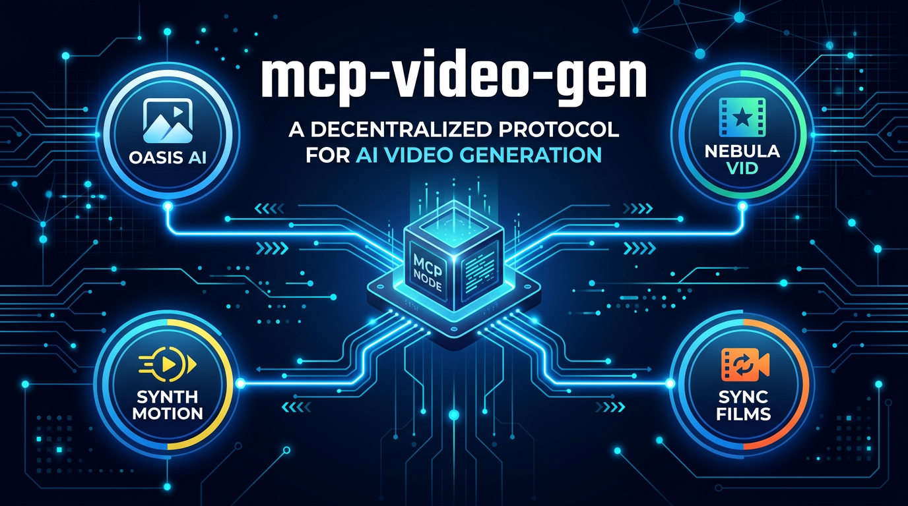
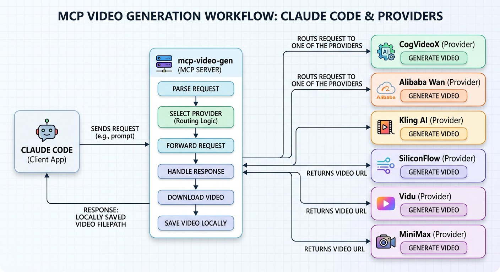

# mcp-video-gen

<p align="center">
  
</p>

<p align="center">
  <a href="https://opensource.org/licenses/MIT"></a>
  <a href="https://www.python.org/downloads/"></a>
  <a href="https://modelcontextprotocol.io/"></a>
  
</p>

<p align="center">
  <strong>多平台 AI 视频、语音、音乐、转录 MCP 服务器。</strong><br>
  7 个视频平台 + 图生视频 + TTS + 音乐 + 语音转文字，统一接口。<br>
  支持 Claude Code、Claude Desktop、Cursor 及所有 MCP 兼容客户端。
</p>

<p align="center">
  <a href="README.md">English</a>
</p>

## 特性

- **7 个视频平台** — 智谱、通义万相、可灵、硅基流动、Vidu、海螺、Google Veo (2/3/3.1)
- **图生视频** — 从参考图片生成视频（Veo）
- **语音合成** — MiniMax TTS（+ Google Chirp 3 HD 需 ADC）
- **音乐生成** — MiniMax Music + **Google Lyria**（纯器乐，~33秒，GCP 赠金）
- **语音转文字** — Google Chirp 2 转录 + 词级时间戳（字幕生成）
- **免费优先** — CogVideoX 完全免费，无限量
- **灵活切换** — 通过 `provider` 参数每次请求选择最优平台
- **自动下载** — 生成的视频/音频自动保存到本地

## 架构图

<p align="center">
  
</p>

### 工作原理

```
用户提示词 → AI 助手（Claude / Cursor）→ MCP Server → 平台 API
                                            ↓
                                generate_video() → task_id
                                query_video_status(task_id) → 下载到本地
```

所有视频平台都使用**异步模式**：提交生成请求，获取 task_id，然后轮询直到完成。MCP 服务器自动处理这个流程。

## 支持的平台

### 视频平台

| 平台 | 模型 | 免费额度 | 画质 | 时长 | 适用场景 |
|---|---|---|---|---|---|
| **智谱清影** CogVideoX-Flash | cogvideox-flash | **完全免费** | 1440x960 | 6秒 | 入门、免费使用 |
| **阿里通义万相** Wan 2.6 | wan2.6-t2v | 50秒（90天） | 最高1080P | 5-10秒 | 高质量、中文内容 |
| **可灵** Kling AI | kling-v2-master | 每天66积分（网页端） | 720p | 5-10秒 | 画质好，每日免费 |
| **硅基流动** SiliconFlow | Wan2.1-T2V-14B | 注册送$1 | 720p | 不定 | 快速测试 |
| **生数科技** Vidu | vidu-2.0 | 200积分（促销） | 720p | 4秒 | 短视频 |
| **MiniMax 海螺** Hailuo 2.3 | Hailuo 2.3 | 付费 | 最高1080P | 6-10秒 | 最高画质 |
| **Google Veo** (Vertex AI) | veo-2.0/3.0/3.1 | GCP 赠金 | 720p-4K | 5-8秒 | 生产环境、GCP 用户 |

#### 平台选择指南

```
需要生成视频？
  ├─ 免费 / 初次尝试？
  │   └─ cogvideo ✅（完全免费，无门槛）
  │
  ├─ 需要最高画质？
  │   ├─ minimax（国内最好，付费）
  │   └─ veo（国际最好，GCP 赠金）
  │
  ├─ 有 GCP 赠金？
  │   ├─ 省钱 → veo-3.0-fast（$0.15/秒，1080p）
  │   └─ 最佳画质 → veo-2.0（$0.50/秒）或 veo-3.0（$0.75/秒）
  │
  └─ 需要长视频（10秒）？
      ├─ dashscope / kling / minimax（支持10秒）
      └─ veo 最长8秒
```

### 音频能力

| 平台 | 能力 | 模型 | 价格 | 环境变量 |
|---|---|---|---|---|
| **MiniMax 海螺语音** | 文字转语音 | speech-2.6-hd | 约 ¥0.01/次 | `MINIMAX_API_KEY` |
| **Google TTS** | 文字转语音 | Chirp 3 HD（52语言） | ~$30/1M字符 | 需 ADC |
| **MiniMax 海螺音乐** | AI 音乐生成（含歌词） | music-2.0 | 约 ¥0.1/首 | `MINIMAX_API_KEY` |
| **Google Lyria** | 纯器乐生成 | lyria-002（~33秒 WAV） | ~$0.06/首 | `GCP_PROJECT_ID` |

### 转录能力

| 平台 | 能力 | 模型 | 价格 | 环境变量 |
|---|---|---|---|---|
| **Google STT** | 语音转文字 + 时间戳 | Chirp 2 | ~$0.016/分钟 | `GCP_PROJECT_ID` |

> - 配置 `MINIMAX_API_KEY` 自动启用 MiniMax 语音和音乐
> - 配置 `GCP_PROJECT_ID` 自动启用 Lyria 音乐和 STT 转录
> - Google TTS 需要 ADC 认证（`gcloud auth application-default login`）

## 快速开始

### 1. 克隆 & 安装

```bash
git clone https://github.com/kevinten-ai/mcp-video-gen.git
cd mcp-video-gen
uv sync              # 基础依赖
uv sync --extra gcp  # 使用 Google Veo 时加这个
```

### 2. 配置 MCP

只需配置你要使用的平台，至少配置一个。

<details>
<summary><b>Claude Code（命令行）— 推荐</b></summary>

```bash
# 最简（仅免费 CogVideoX）
claude mcp add -s user mcp-video-gen \
  --env COGVIDEO_API_KEY=你的key \
  -- uv --directory /path/to/mcp-video-gen run video-gen

# 完整（含 Veo）
claude mcp add -s user mcp-video-gen \
  --env COGVIDEO_API_KEY=你的key \
  --env KLING_ACCESS_KEY=你的ak \
  --env KLING_SECRET_KEY=你的sk \
  --env MINIMAX_API_KEY=你的key \
  --env GCP_PROJECT_ID=你的项目ID \
  --env GEMINI_API_KEY=你的gcp_api_key \
  -- uv --directory /path/to/mcp-video-gen run --extra gcp video-gen
```

> **重要：** `--extra gcp` 必须放在 `run` 后面，不能放在 `run` 前面。

</details>

<details>
<summary><b>Claude Desktop / Cursor（JSON 配置）</b></summary>

```json
{
  "mcpServers": {
    "mcp-video-gen": {
      "command": "uv",
      "args": ["--directory", "/path/to/mcp-video-gen", "run", "--extra", "gcp", "video-gen"],
      "env": {
        "COGVIDEO_API_KEY": "你的key",
        "GCP_PROJECT_ID": "你的项目ID",
        "GEMINI_API_KEY": "你的gcp_api_key"
      }
    }
  }
}
```

</details>

### 3. 使用

直接告诉 AI 助手：

```
"生成一段猫弹钢琴的视频"
```

AI 助手会调用 `generate_video`，等待，然后调用 `query_video_status` 下载结果。

## 工具说明（共 7 个）

### 视频
- **generate_video** — 文生视频或图生视频。参数：`prompt`、`provider`、`duration`（5/10）、`aspect_ratio`（16:9/9:16/1:1）、`image_url`（图生视频，仅 Veo）
- **query_video_status** — 轮询状态并自动下载。参数：`task_id`、`provider`

### 音频
- **generate_speech** — 文字转语音。参数：`text`、`provider`（minimax/google-tts）、`voice_id`、`speed`（0.5-2.0）
- **generate_music** — AI 音乐生成。参数：`prompt`、`provider`（minimax/google-lyria）、`lyrics`（可选）

### 转录
- **transcribe_audio** — 语音转文字 + 词级时间戳（Google Chirp 2）。参数：`audio_path`、`language_code`。可配合 `ffmpeg add_subtitles` 实现全自动字幕

### 工具
- **list_providers** — 列出所有已配置的视频、语音、音乐、转录平台

## 环境变量

| 变量 | 平台 | 说明 |
|---|---|---|
| `COGVIDEO_API_KEY` | 智谱清影 | 至少配置 |
| `DASHSCOPE_API_KEY` | 阿里通义万相 | 一个平台 |
| `KLING_ACCESS_KEY` | 可灵 | |
| `KLING_SECRET_KEY` | 可灵 | |
| `SILICONFLOW_API_KEY` | 硅基流动 | |
| `VIDU_API_KEY` | 生数 Vidu | |
| `MINIMAX_API_KEY` | MiniMax 海螺 + TTS + 音乐 | |
| `MINIMAX_API_HOST` | MiniMax | 可选，默认 `https://api.minimax.chat` |
| `GCP_PROJECT_ID` | Google Veo | Veo 必填 |
| `GEMINI_API_KEY` | Google Veo | 推荐（或用 ADC） |
| `GCP_REGION` | Google Veo | 可选，默认 `us-central1` |
| `VEO_MODEL` | Google Veo | 可选，默认 `veo-2.0-generate-001` |
| `VEO_GCS_BUCKET` | Google Veo | 可选，GCS 存储桶 |
| `VIDEO_OUTPUT_DIR` | 输出目录 | 可选，默认 `./output` |

## 常见问题排查

### 通用错误

| 错误 | 根因 | 解决方案 |
|---|---|---|
| `No providers configured` | 没设置任何 API Key | 至少设置一个平台的 API Key |
| `Unknown provider` | 拼写错误或平台未配置 | 用 `list_providers` 查看可用选项 |
| `Still processing` | 视频还在生成 | 正常 — 30秒后再查询 |

### 平台特定错误

| 错误 | 平台 | 解决方案 |
|---|---|---|
| `访问量过大` | 智谱 | 免费模型高峰期过载，稍后重试 |
| `JWT token error` | 可灵 | 检查 `KLING_ACCESS_KEY` 和 `KLING_SECRET_KEY` 都已设置 |
| `Auth failed: credentials not found` | Veo | 设置 `GEMINI_API_KEY` 或运行 `gcloud auth application-default login` |
| `429 quota exceeded` | Veo | Vertex AI 速率限制（10 RPM），等1分钟或换模型 |
| `Video blocked by safety filter` | Veo | 内容被安全过滤，修改提示词避免敏感内容 |

### Veo 特别说明

- **API Key vs ADC**：`GEMINI_API_KEY` 最简单，同一个 key 可以同时用于 mcp-image-gen 和 mcp-video-gen
- **`--extra gcp` 位置**：必须放在 `run` 后面：`uv --directory /path run --extra gcp video-gen`
- **省钱建议**：用 `veo-3.0-fast-generate-001`（$0.15/秒）替代默认 Veo 2（$0.50/秒），节省 70% 且输出 1080p

## 项目结构

```
src/video_gen/
├── __init__.py
├── server.py              # MCP 服务器 + 工具定义
├── providers/
│   ├── __init__.py        # Provider 基类 + 注册机制
│   ├── cogvideo.py        # 智谱 CogVideoX-Flash
│   ├── dashscope.py       # 阿里 通义万相 Wan 2.6
│   ├── kling.py           # 可灵 Kling AI (JWT 认证)
│   ├── siliconflow.py     # 硅基流动 SiliconFlow
│   ├── vidu.py            # 生数 Vidu
│   ├── minimax.py         # MiniMax 海螺
│   └── veo.py             # Google Veo (Vertex AI, API Key + ADC)
└── audio/
    ├── __init__.py        # TTS/音乐 基类 + 注册机制
    ├── minimax_tts.py     # MiniMax 语音合成 (speech-2.6-hd)
    ├── minimax_music.py   # MiniMax 音乐生成 (music-2.0)
    ├── google_lyria.py    # Google Lyria 2 纯器乐生成 (Vertex AI)
    ├── google_tts.py      # Google Cloud TTS Chirp 3 HD (需 ADC)
    └── google_stt.py      # Google Cloud STT Chirp 2 (语音转文字)
```

### 添加新平台

1. 创建 `src/video_gen/providers/your_provider.py`
2. 实现 `BaseProvider`（属性：`name`、`description`、`free_tier_info`；方法：`generate()`、`query()`）
3. 在 `server.py:_init_providers()` 中注册，通过环境变量控制启用
4. 新平台自动出现在 `list_providers` 和 `generate_video` 工具中

## 本地开发

```bash
git clone https://github.com/kevinten-ai/mcp-video-gen.git
cd mcp-video-gen
uv sync --extra gcp  # 全部依赖

# 直接运行
uv run video-gen

# MCP Inspector 调试
npx @modelcontextprotocol/inspector uv --directory . run --extra gcp video-gen
```

## 相关项目

- [mcp-image-gen](https://github.com/kevinten-ai/mcp-image-gen) — AI 图片生成 MCP 服务器（Gemini + Imagen）
- [mcp-3d-gen](https://github.com/kevinten-ai/mcp-3d-gen) — AI 3D 模型生成 MCP 服务器

## 许可证

MIT — 详见 [LICENSE](LICENSE)。
